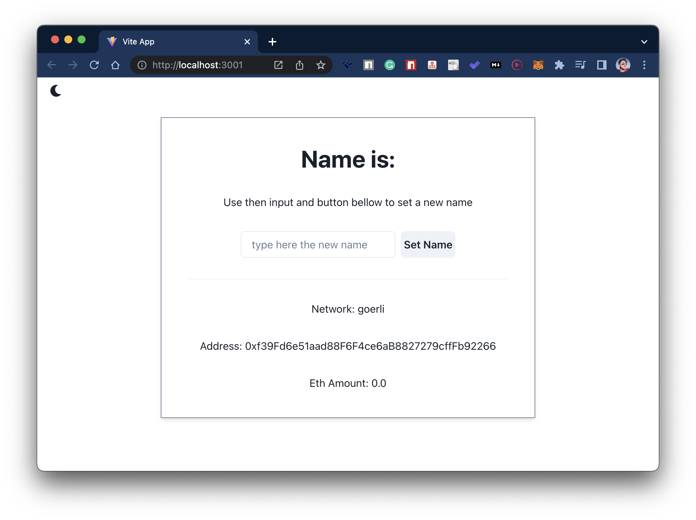
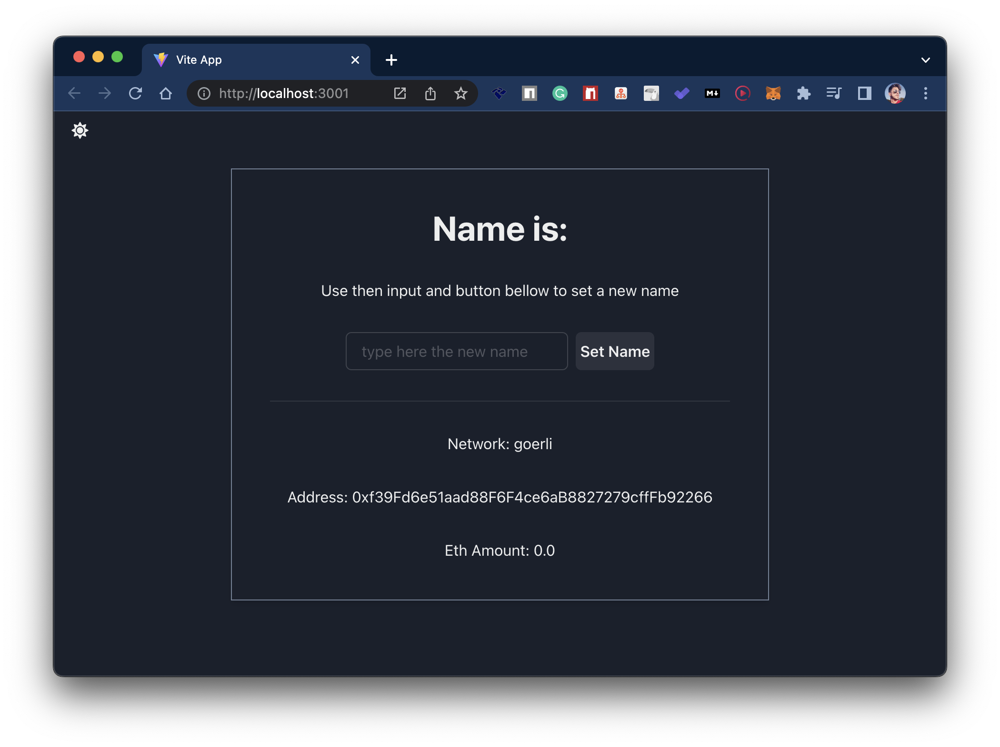
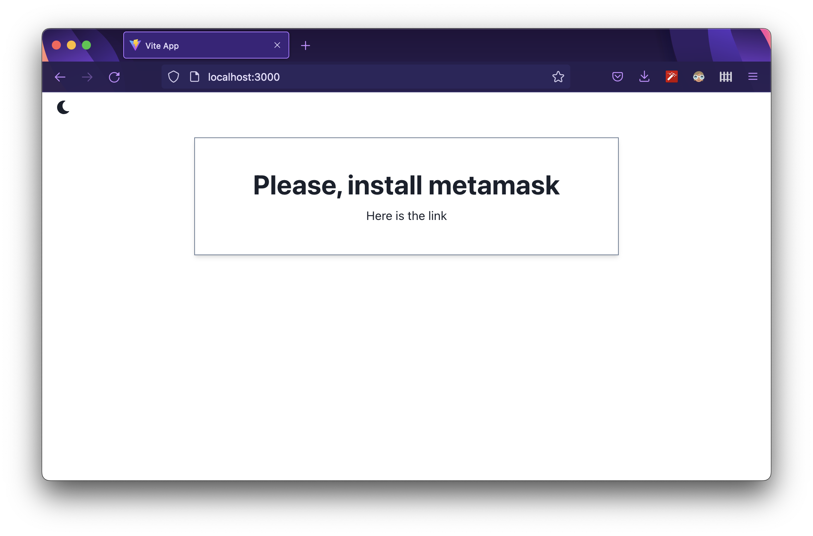
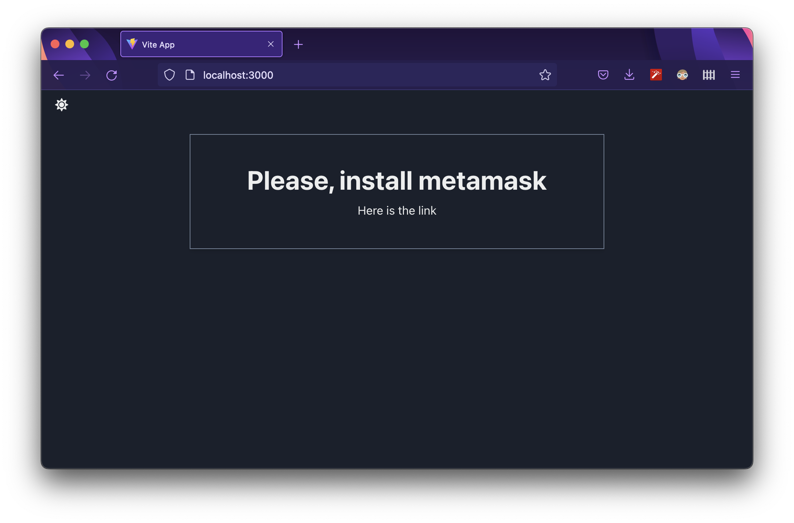
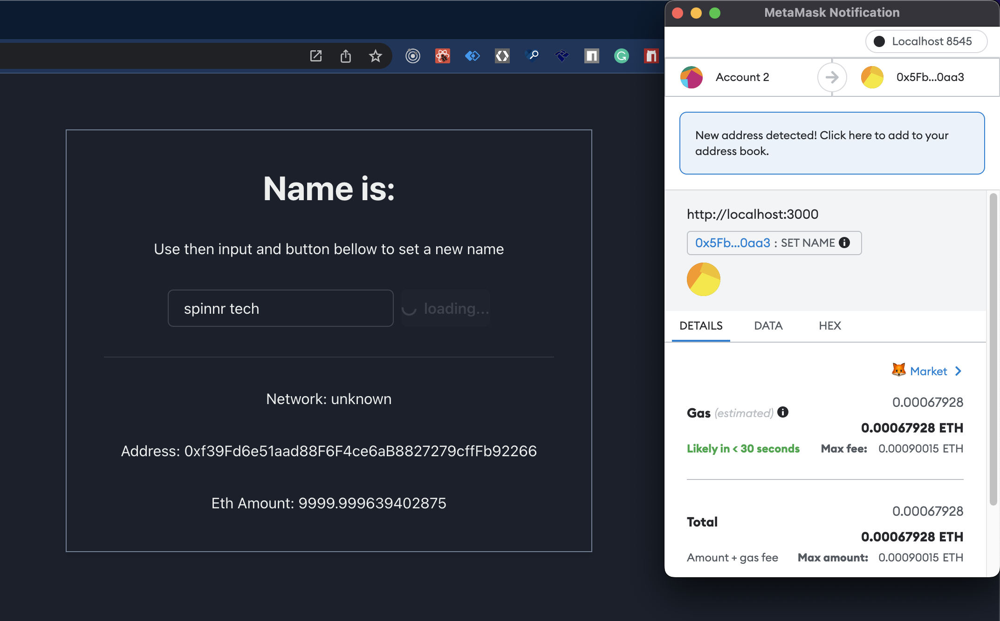
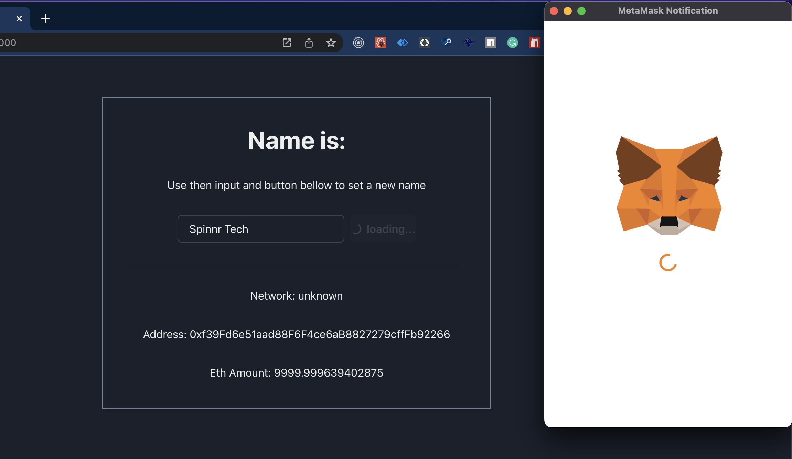

<h1 align="center">Spinnr Tech Dapp</h1>

https://user-images.githubusercontent.com/38187170/175774502-f3e38cca-7d27-4c68-b0a8-d15a55025e32.mp4


<p>
  
</p>

> Dapp with hardhat, solidity, and react with typescript and chakra-ui

## Important Observation

  The smart contract is __yet not deployed in a testnet__ because I did not have yet enough eth to accomplish the deployment.

## Live example

  https://spinner-tech-dapp.vercel.app/

## Description

  This Web app is made using React with Typescript and lets the user set a name in a blockchain using an input field. To do it, the user needs the Metamask chrome extension installed in his browser. Once the user has the Metamask installed, he can expense some eth to change the name. Once the transaction is complete, all clients accessing the website will see the changes.

## How it was made?

  The project contains two main folders:
  in the chain folder, you will find the smart contract written in solidity and also the script for deployment, and the test for that contract.
  in the frontend folder, you will find a Vite react typescript project using chakra-ui and ethers.js. For the frontend, the logic that connects and read from the block is in the use-name and use-signer and the blockchain.ts files. First, if the user doesn't have the metamask installed in his browser, the UI will display an image showing the link to the chrome extension. If the user has that, once the user gets into the website, metamask will open and the user can connect with it. Then, if the user types a new name and clicks the button, the metamask will open. After the user confirms the transaction, the header in the frontend will update after a while with the new name typed.\
  Also, in order to check if the user is not setting a name that was already been used, i query for all the events and, depending if he checked the checkbox, i do the proper logic to set a name with a prefix.

## Running the project locally

1. First, clone the app using

    ```
      git clone https://github.com/fernandobelotto/spinnr-tech-dapp
    ```
1. then, install the dependencies in chain and frontend folder using

    ```
      cd ./chain && npm i
      cd ./frontend && npm i
    ```

1. run a local network in order to test
    ```
      npm run node
    ```
1. After running deploy the smart contract using

    ```
      npm run deploy:local
    ```

1. Grab the contract address in the console and set in the .env.example file in frontend, also, change the file name from .env.example to .env

1. After that, run the frontend using

    ```
      npm run dev
    ```

1. Open http://localhost:3000 and check the app

## Screenshots








